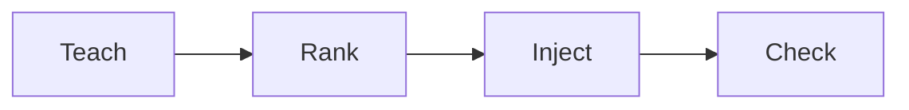

## Teach

You write taste in the dashboard, with `stacktaste learn`, or by correcting Cursor. Stop-hook harvests “do not use X” into a **proposed** item.

## Rank

`@stacktaste/core` ranks locally. No embeddings. Blocking policies always go first, then a character budget by authority, confidence, recency, and path match.

## Inject

Three paths, same ranking:

| Path | When |
| --- | --- |
| Cursor hooks | sessionStart, beforeSubmitPrompt, afterFileEdit |
| MCP `taste_context` | Agent calls the tool |
| `.cursor/rules/stacktaste.mdc` | Regenerated on pull, sync, and review |

`preToolUse` denies a tool call when the payload matches a blocking policy needle.

## Check

`stacktaste check` pulls if local files are behind, then scans changed files against blocking policies.

Cloud is **not** required for inject if `.stacktaste/` exists.
