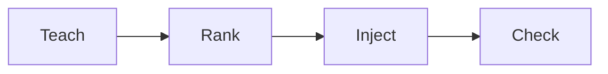

## Teach

Write taste in the dashboard, with `stacktaste learn`, or by correcting Cursor. The stop hook harvests “do not use X” into a **proposed** item.

Nothing is live for the team until someone **accepts** it — dashboard, `stacktaste review accept`, or MCP `taste_review`.

## Rank

`@stacktaste/core` ranks locally. No embeddings. Blocking policies always go first, then a character budget by authority, confidence, recency, and path match.

## Inject

Three paths, same ranking:

| Path | When |
| --- | --- |
| Cursor hooks | sessionStart, beforeSubmitPrompt, afterFileEdit |
| MCP `taste_context` | Agent calls the tool |
| `.cursor/rules/stacktaste.mdc` | Regenerated on pull, sync, review, and learn |

Cloud is **not** required for inject if `.stacktaste/` exists.

## Block

`preToolUse`, `beforeShellExecution`, and `beforeMCPExecution` deny a matching tool, shell, or MCP call.

The user sees a **StackTaste Alert** with the policy title and the full reason. The agent is told not to retry or work around it, and to ask if they want a one-off exception.

<Warning>
A chat “yes” does not lift the block. Accept an exception from review or the dashboard. Exceptions are long-lived taste items — they do not expire, and they do not turn the original policy off by themselves today.
</Warning>

## Check

`stacktaste check` pulls if local files are behind, then scans changed files against blocking policies.
